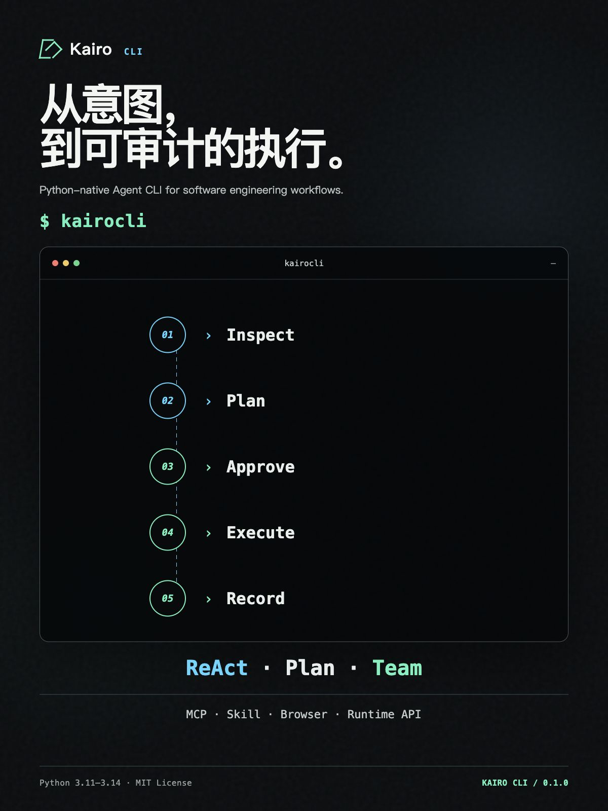

# Kairo CLI

> 从意图，到可审计的执行。

Kairo CLI 是用 Python 开发的 Agent CLI，将规划、协作、工具与上下文收束进一个安全可控的工程运行时。它既可以作为交互式终端助手使用，也可以通过结构化输出接入脚本，或以本地 Runtime API 的形式嵌入其他应用。

<p align="center">
  <a href="landing/index.html">
    
  </a>
</p>

<p align="center">
  <a href="#快速开始">快速开始</a>
  ·
  <a href="landing/index.html">产品页</a>
  ·
  <a href="docs/architecture.md">架构说明</a>
</p>

> [!IMPORTANT]
> 当前版本为 `0.1.0`，仍处于积极开发阶段。

## 目录

- [核心能力](#核心能力)
- [产品预览](#产品预览)
- [环境要求](#环境要求)
- [快速开始](#快速开始)
- [使用方式](#使用方式)
- [配置](#配置)
- [安全模型](#安全模型)
- [项目数据与指令](#项目数据与指令)
- [开发](#开发)
- [文档与演示](#文档与演示)
- [许可](#许可)

## 核心能力

| 能力 | 说明 |
| --- | --- |
| 多种执行模式 | 支持 ReAct、带人工审阅的 Plan-and-Execute，以及依赖感知的 Team 协作 |
| 工程工具 | 文件读写、安全补丁、受控 Shell、代码索引、语义搜索、符号关系、LSP 诊断和图片输入 |
| 上下文管理 | 项目指令、长期记忆、自动压缩、结构化 Todo、工作区快照和可恢复会话 |
| 可扩展集成 | 支持 MCP tools/resources/prompts、Skill 分层加载和 Chrome DevTools 浏览器会话 |
| 自动化入口 | 提供非交互式 `text` / `json` / `jsonl` 输出和本地 Runtime API |
| 多模型接入 | 内置 GLM、DeepSeek、Step、Kimi、FreeLLMAPI、讯飞星火 MaaS 和 Agnes AI 配置 |
| 安全与审计 | 工作区路径围栏、危险操作审批、默认拒绝的无人值守策略、凭据脱敏和审计记录 |
| 多终端体验 | 支持 inline（含代码语法高亮）、plain 和 Textual 全屏 TUI，并可通过微信通道远程交互 |

更细的实现状态见[功能验收矩阵](docs/feature-matrix.md)，系统边界见[架构说明](docs/architecture.md)。

## 产品预览

新版响应式产品页围绕 Kairo CLI 的完整执行链展开：

```text
Inspect → Plan → Approve → Execute → Record
```

- 三种执行模式：ReAct、Plan、Team
- 扩展入口：MCP、Skill、Browser、Runtime API、WeChat
- 控制边界：工作区路径围栏、危险操作审批、默认拒绝策略、凭据脱敏与审计

查看[响应式产品页](landing/index.html)、[海报源文件](poster/index.html)或[导出的 1200×1600 产品海报](assets/kairocli-poster-1200x1600.png)。

## 环境要求

- Python `3.11`–`3.14`
- macOS、Linux 或 Windows
- 至少一个受支持模型服务的 API Key
- 可选：Chrome 和可用的 `npx`，用于默认的 Chrome DevTools MCP 集成

## 快速开始

### 1. 安装

项目目前从源码安装。获取源码后进入项目目录：

```bash
cd /path/to/KairoCLI
python3 -m venv .venv
source .venv/bin/activate
python -m pip install -e .
```

Windows PowerShell 的虚拟环境激活命令为：

```powershell
.venv\Scripts\Activate.ps1
```

### 2. 配置模型

复制配置模板，并填写至少一个 Provider 的 API Key：

```bash
cp .env.example .env
```

例如使用 GLM：

```dotenv
GLM_API_KEY=your-api-key
KAIROCLI_PROVIDER=glm
```

也可以使用对应环境变量：

| Provider | API Key 环境变量 | 默认模型 |
| --- | --- | --- |
| GLM | `GLM_API_KEY` | `glm-5.1` |
| DeepSeek | `DEEPSEEK_API_KEY` | `deepseek-v4-flash` |
| Step | `STEP_API_KEY` | `step-3.5-flash` |
| Kimi | `KIMI_API_KEY` | `kimi-k2.6` |
| FreeLLMAPI | `FREELLMAPI_API_KEY` | `auto` |
| 讯飞星火 MaaS | `XFYUN_MAAS_API_KEY` | `Qwen3.6-35B-A3B` |
| Agnes AI | `AGNES_API_KEY` | `agnes-2.0-flash` |

长期记忆默认使用本地关键词检索。若明确允许 embedding 服务处理已保存的记忆，
可启用关键词与语义混合检索：

```dotenv
KAIROCLI_MEMORY_SEMANTIC_SEARCH=true
KAIROCLI_EMBEDDING_PROVIDER=ollama
KAIROCLI_EMBEDDING_MODEL=nomic-embed-text:latest
KAIROCLI_EMBEDDING_BASE_URL=http://localhost:11434
```

也可使用百炼的 OpenAI 兼容 API：

```dotenv
KAIROCLI_MEMORY_SEMANTIC_SEARCH=true
KAIROCLI_EMBEDDING_PROVIDER=alicloud
KAIROCLI_EMBEDDING_BASE_URL=https://YOUR_WORKSPACE_ID.cn-beijing.maas.aliyuncs.com/compatible-mode/v1
KAIROCLI_EMBEDDING_MODEL=qwen3.7-text-embedding-flash
KAIROCLI_EMBEDDING_DIMENSIONS=1024
KAIROCLI_EMBEDDING_MAX_BATCH_SIZE=20
DASHSCOPE_API_KEY=your-api-key
```

`alicloud` 只接受 HTTPS 的 `aliyuncs.com/compatible-mode/v1` 业务空间地址，并强制请求
float 向量。也支持 `openai` 或 `zhipu` provider；远程服务会接收用于建立索引的长期记忆
文本和代码片段。`/save` 与 Agent 的 `save_memory` 会立即建立记忆向量；若 embedding 暂时
失败，原始记忆仍会保存并在后续检索时补建。`/memory search`、自动记忆检索和
`search_memory` 使用同一套混合检索。代码 `/index` 与 `/search` 复用同一 embedding 配置；
更换模型或维度后必须执行一次完整 `/index`。未启用记忆语义检索时会自动使用关键词检索。
代码索引使用 Python AST 和常见语言的 Tree-sitter 语法树按声明分块，并保留声明之间的
顶层代码；解析器不可用时自动回退到正则或滑动窗口分块。

> [!CAUTION]
> `.env` 和真实密钥不得提交到版本库。Kairo CLI 会读取全局的
> `~/.kairocli/.env` 和当前项目的 `.env`，项目配置覆盖全局配置，进程环境变量优先于两者。

若希望所有工作区共享同一套 Provider 配置，可创建 KairoCLI 专用的全局配置：

```bash
mkdir -p ~/.kairocli
cp .env.example ~/.kairocli/.env
chmod 600 ~/.kairocli/.env
```

### 3. 启动

在需要处理的项目目录中运行：

```bash
kairocli
```

首次进入项目后，可初始化项目级指令：

```text
/init
```

然后直接描述任务，例如：

```text
分析这个项目的测试结构，并给出三个最值得优先修复的问题。
```

## 使用方式

### 交互式 CLI

Kairo CLI 默认使用 inline 渲染器。输入 `/help` 查看完整命令索引，常用命令包括：

```text
/plan TASK                 生成计划，审阅后执行
/team TASK                 使用多 Agent 团队执行
/index [PATH]              建立工作区代码索引
/search QUERY              搜索已索引代码
/memory list               按列显示长期记忆及其创建时间
/session                   管理可恢复会话
/todo                      管理当前任务清单
/mcp                       管理 MCP 服务和资源
/skill list                查看精简的 Skill 列表；用 /skill show NAME 查看完整详情
/policy                    查看当前安全策略
/snapshot                  查看工作区快照
/cancel                    取消当前任务
/exit                      退出 Kairo CLI
```

`/index` 会立即在单行进度条中显示扫描状态和当前文件；远程 embedding 服务返回短暂的
HTTP 429 限流时会自动重试，持续限流则保留原错误并停止索引。向量请求按模型的
batch 大小分组，每次最多并发两组，避免索引大仓库时制造瞬时请求洪峰。
索引结果默认折叠，按 `Ctrl+O` 可以展开或折叠本次已索引文件的目录树；
展开区会按终端高度显示尽可能多的目录树；可用方向键逐行浏览，
也可用 `PageUp` / `PageDown` 翻页，笔记本可使用 `Fn+↑` / `Fn+↓`。

Agent 会自动检索相关长期记忆，也可在追问记忆来源或已有偏好时调用只读的
`search_memory` 工具。带稳定 `key` 的新记忆会替换同作用域的旧版本；旧版本保留为
`superseded`，不会进入普通检索。当前项目的同 key 记忆优先于全局记忆。

使用 `@relative/path` 或 `@<path with spaces>` 将工作区文件或目录加入上下文：

```text
请审查 @src/kairocli/policy.py
总结 @docs/feature-matrix.md 中仍需推进的能力
```

输入 `@` 时会像 `/` 命令一样显示最多 8 行可滚动的纵向路径菜单；路径菜单不显示说明文字，可使用方向键选择，并用 `Tab` 或 `Enter` 补全。

消息输入框支持多行编辑：按 `Shift+Enter` 插入换行，按 `Enter` 提交；粘贴多行文本时会保留并显示原有换行。

### Plan 与 Team 模式

交互模式下使用 `/plan` 或 `/team`；脚本中使用 `--mode`：

```bash
kairocli -p "规划并实现缓存层" --mode plan
kairocli -p "并行审查安全性、性能和测试覆盖" --mode team
```

Plan 模式会在交互终端中等待审阅；非交互模式会直接执行生成的计划。

### 非交互式执行

使用 `-p` / `--print` 执行单轮任务：

```bash
kairocli -p "检查项目并给出风险"
kairocli -p "运行测试并解释失败" --output-format json
printf '%s' '总结当前改动' | kairocli --print --output-format jsonl
```

`--output-format` 支持：

- `text`：只向 stdout 写入最终回答；
- `json`：输出一条 schema v1 结果；
- `jsonl`：依次输出 start/result 事件。

成功、执行失败和取消的退出码分别为 `0`、`1` 和 `130`；参数或启动配置错误使用 `2`。

无人值守模式不会等待人工审批，危险工具默认拒绝。按工具名精确授权：

```bash
kairocli -p "修复格式问题" \
  --allow-tool write_file \
  --allow-tool apply_patch
```

只有调用环境已经提供等价安全边界时，才应使用 `--dangerously-skip-approvals`。

### 恢复会话

```bash
kairocli --continue
kairocli --resume session_xxxxxxxxxxxx
kairocli -p "记录本次检查结果" --save-session
```

`--continue` 恢复当前工作区最近的非空会话；`--resume` 按 ID 恢复。交互式 CLI
可使用 `/session list` 查看按最近更新时间排序的会话，当前会话以 `●` 标记。列表默认
隐藏非当前的空会话；使用 `/session list --all` 查看全部会话。

会话删除始终限制在当前工作区，且不能删除当前活动会话：

```text
/session delete --empty
/session delete session_xxxxxxxxxxxx session_yyyyyyyyyyyy
```

`--empty` 删除全部非当前空会话；指定多个 ID 时会先校验全部会话，再执行原子批量删除。

### Runtime API

设置独立 API Key 后启动仅监听 `127.0.0.1` 的服务：

```bash
KAIROCLI_RUNTIME_API_KEY=local-secret \
  kairocli serve --http --port 8080
```

客户端可通过 `X-Kairo-CLI-API-Key` 或 `Authorization: Bearer <key>` 鉴权。Runtime API 提供 thread 创建、turn 执行与取消，以及支持游标恢复的 SSE 事件流；持久化数据库位于 `~/.kairocli/runtime/runtime.db`。

如需带登录、会话列表、流式对话和工具审批的多用户 Web 界面，可运行：

```bash
kairocli serve --http --web --port 8080
```

IM worker 并发账号上限默认是 100，可按单机容量调整：

```bash
kairocli serve --http --web \
  --max-active-channel-accounts 100 \
  --channel-history-retention-days 30
```

Web 服务默认仅监听 `127.0.0.1`；需要在可信局域网内访问时额外传入 `--lan`，绑定到
`0.0.0.0`。首次在交互式终端启动时会引导输入管理员邮箱和密码；非交互式部署须设置
`KAIROCLI_WEB_ADMIN_EMAIL`，系统会输出一次性临时密码。用户与 JWT 密钥保存在
`~/.kairocli/web/`。

Web 使用邮箱注册和登录，每个用户自动获得不可修改的账号 ID。公开注册必须先通过腾讯云
SES 邮箱验证码；邮件服务未配置完整时公开注册关闭，管理员仍可在后台创建账号。忘记密码
也使用同一验证码邮件模板，重置成功后该账号的旧会话全部失效。新用户默认获得 ¥1.00 平台余额，但必须由管理员授权工作区后才能创建
对话或连接 IM。管理员可统一调整每个用户的人民币余额和月额度；“每月自动重置”默认
关闭，开启后余额会在新月份替换为月额度，不结转。使用平台 API Key 时按
`pricing.json` 的人民币单价扣费，单次请求允许产生小额负余额；用户配置自己的 API Key
后不扣平台余额，调用失败也不会回退到平台 Key。平台 Key 只能使用管理员在服务端配置的
模型，BYOK 用户可以选择自己 Key 支持的模型。Web 会话使用 HttpOnly Cookie 和 CSRF
校验，登录响应仍保留 Bearer token 字段供 API 客户端兼容使用。

登录 Web 控制台后可按对话轮次选择 `ReAct`、`Plan` 或 `Team` 模式。`Plan` 模式会先
展示执行计划，等待批准、取消或补充意见后再执行；`Plan` 与 `Team` 模式都会实时展示
各任务的运行状态。页面顶部同时显示当前 Provider 与模型。管理员和普通用户均可使用
模型配置与配置快照；每个账号的 Provider、模型、API Key 和快照独立保存，且后续对话
只会使用当前登录账号的模型配置。

Web 侧边栏只列出默认工作区、用户主动选择过的项目，以及已有历史对话的项目，不会
一次性加载允许根目录下的所有文件夹。点击项目可在原位展开自己的近期对话，再次点击
则折叠；超过四条时可以继续展开。新建对话在首次发送消息后才会出现在侧边栏，并由独立
LLM 请求异步生成简短标题；标题生成完成后会立即更新，无需等待主回答结束，生成失败时
保留首条消息的截断标题。每个对话固定
绑定创建时选择的目录，重新打开历史
对话时会恢复对应工作区，不会改变已有对话的文件权限边界。可以通过“选择其他文件夹”
浏览并添加项目。管理员可浏览并使用主机上当前 Kairo CLI 进程有权读取的目录，无需先给
自己授权；普通用户只能看到和使用管理员明确授权的项目。目录浏览只返回文件夹信息并
忽略符号链接，且不会绕过操作系统自身的文件权限。

Web 回答通过可重连的 SSE 长连接实时传输。模型输出会按短时间窗口合并后推送，前端
按浏览器渲染帧追加文本，并在回答结束时完成 Markdown 与代码高亮渲染；断线重连时会
从最后一个事件 ID 继续，避免重复或丢失已经持久化的内容。
即使使用 `--lan`，远程浏览器选择的仍是运行 Kairo CLI 的主机目录，而不是浏览器设备
的目录。

每个项目右侧提供“新建会话”和“移除项目”操作。新建会话直接使用对应项目作为工作区；
移除项目必须再次确认，会从当前账号的项目列表中移除该目录并永久清除其全部 Web 会话
记录，但不会删除主机上的实际文件夹。存在运行中任务的项目必须先停止任务才能移除。

### 微信通道

多用户 Web 模式在“设置 → 通道 → 微信”中扫码。二维码图片在服务端生成，微信 token
不会下发到浏览器；一个用户当前只能绑定一个微信身份，同一微信身份不能绑定多个用户。
扫码前从首页左侧已添加的工作区中选择一个并启用通道，微信消息会进入 SQLite 持久 inbox，再由
单机 AsyncIO worker 串行处理该账号的消息。在微信中发送 `/workspace` 查看授权列表，
发送 `/workspace 2`（也支持名称或完整路径）即可切换并恢复对应会话。读取工具自动允许，写入工具需在微信中使用
一次性审批码确认，Shell 与 MCP 默认拒绝。切换工作区会恢复该工作区独立的微信会话；
断开连接会停止 worker 并删除连接凭证；会话默认保留 30 天，服务启动时清理过期记录。

从旧版 CLI 绑定迁移前先停止 daemon，并指定已存在且已获工作区授权的 Web 用户：

```bash
kairocli wechat daemon stop
kairocli wechat migrate-web --account-id user_0123456789abcdef
```

迁移后旧凭证会保存为 `~/.kairocli/wechat/account.migrated.json`，Web 绑定默认关闭，需在
页面中手动启用。Web 服务检测到旧 daemon 仍运行时会拒绝启动，避免同一微信账号被两个
轮询进程同时消费。

旧版单用户 CLI 通道仍可单独运行：

```bash
kairocli wechat setup
kairocli wechat start
kairocli wechat status
kairocli wechat daemon start
kairocli wechat daemon logs
kairocli wechat daemon stop
```

运行 `wechat setup` 时，Kairo CLI 会先显示微信 Agent 可访问的目录；直接按 Enter 使用当前目录，输入另一个已存在的目录，或按 Esc 取消，然后按提示扫码绑定。

交互模式的命令列表只显示一级入口。对于包含子命令的命令，输入一级命令和空格后会按需展开，例如 `/wechat ` 会显示 `setup`、`start`、`status` 和 `stop`；直接执行 `/wechat` 则会显示当前状态与子命令提示。

微信通道采用独立的默认拒绝策略，不会发送 reasoning、工具进度或 diff。当前媒体消息仅保留安全的元数据，文件和图片下载/解密尚未启用。

## 配置

配置按以下优先级合并，后者覆盖前者：

1. 内置默认值；
2. `~/.kairocli/config.json`；
3. `~/.kairocli/.env`；
4. 当前项目的 `.env`；
5. 进程环境变量；
6. CLI 参数。

常用环境变量：

| 变量 | 默认值 | 用途 |
| --- | --- | --- |
| `KAIROCLI_PROVIDER` | `glm` | 默认 Provider |
| `KAIROCLI_RENDERER` | `inline` | `inline`、`plain` 或 `tui` |
| `KAIROCLI_TASK_WORKERS` | `2` | 持久后台任务 worker 数量，范围 `1`–`32` |
| `KAIROCLI_RUNTIME_API_KEY` | 空 | Runtime API 鉴权密钥 |
| `KAIROCLI_NO_TUI` | `false` | 禁止使用全屏 TUI |
| `KAIROCLI_LOG_ENABLED` | `true` | 启用脱敏后的应用日志 |
| `KAIROCLI_TRACE_ENABLED` | `false` | 启用私有模型诊断 trace，记录每次模型请求的消息、工具 schema 与响应 |
| `KAIROCLI_TRACE_REASONING` | `false` | 在 trace 中额外记录 reasoning，需显式开启 |
| `KAIROCLI_MAIL_ENABLED` | `false` | 启用腾讯云 SES 邮件服务（Web 注册验证码与测试邮件） |
| `KAIROCLI_MAIL_PROVIDER` | `tencent-ses` | 邮件服务提供商；当前支持 `tencent-ses` |
| `KAIROCLI_WEB_ADMIN_EMAIL` | 空 | 非交互式 Web 首次启动时创建管理员所用的邮箱 |
| `KAIROCLI_MAIL_FROM_ADDRESS` | 空 | SES 发信地址，需在 SES 控制台完成发信域名配置 |
| `KAIROCLI_MAIL_TEMPLATE_TEST` | 空 | 已审核通过的测试邮件模板 ID |
| `KAIROCLI_MAIL_TEMPLATE_VERIFICATION` | 空 | 已审核通过的验证码邮件模板 ID |

在交互式 CLI 中可查看或修改 Provider 配置：

```text
/model
/model deepseek
/config
/config provider deepseek api-key YOUR_KEY
/config provider deepseek model deepseek-v4-flash
```

Provider 的 `base-url`、`model`、`lora-id`、`context-window`、`temperature` 和 `max-tokens` 也可通过 `/config` 修改。详细模板见 [.env.example](.env.example)。

`/context`（也可输入 `/ctx`）以中文分区显示当前会话的上下文占用进度条，并按系统提示词、工具定义和会话消息拆分估算 token；其余分区列出自动压缩阈值与剩余额度、记忆状态、模型调用用量和费用估算。上下文占用是当前估算值，调用用量是会话累计值。

模型费用估算由用户级 `~/.kairocli/pricing.json` 管理。Kairo CLI 首次启动时会生成该文件，之后每次启动重新读取；可直接修改 Provider 默认单价、价格生效时间、时区、高峰时段及模型匹配规则。单价单位为人民币元/百万 token，`input`、`cached` 和 `output` 分别表示未缓存输入、缓存输入和输出。配置无效时 CLI 会继续使用内置默认价格，并在 `/context` 中显示回退提示。

### 邮件服务

Web 控制台的注册验证码通过腾讯云 SES 发送。在 `.env` 中启用邮件服务并填写：

- 邮件服务提供商：`KAIROCLI_MAIL_PROVIDER=tencent-ses`；
- 腾讯云 API 密钥：`KAIROCLI_TENCENT_SECRET_ID`、`KAIROCLI_TENCENT_SECRET_KEY`；
- 发信地址：`KAIROCLI_MAIL_FROM_ADDRESS`（需先在 SES 控制台完成发信域名配置）；
- 已审核通过的模板 ID：`KAIROCLI_MAIL_TEMPLATE_TEST`（测试邮件）、
  `KAIROCLI_MAIL_TEMPLATE_VERIFICATION`（验证码邮件），模板示例见
  [docs/mail-templates](docs/mail-templates)。

启用后 Web 注册与密码重置使用邮箱验证码，验证码默认 5 分钟有效、60 秒内不可重发；
未启用时关闭公开注册和自助密码重置。应用日志只记录脱敏后的投递元数据，不记录验证码内容。配置完成
后可发送测试邮件自检：

```bash
kairocli mail test --to you@example.com
```

### MCP

用户级和项目级 MCP 配置分别位于：

```text
~/.kairocli/mcp.json
<workspace>/.kairocli/mcp.json
```

项目级同名 server 覆盖用户级配置。Kairo CLI 支持 stdio 和 Streamable HTTP MCP，并在首次运行时创建隔离模式的 Chrome DevTools MCP 默认配置；单个 MCP 启动失败不会阻止主程序启动。

## 安全模型

Kairo CLI 的默认安全边界包括：

- 文件工具只能访问当前工作区允许的真实路径，并拒绝符号链接逃逸；
- 危险操作在交互模式中需要审批，在非交互模式中默认拒绝；
- 写入型工具串行执行，只读工具可受控并发；
- Shell 命令运行在独立进程组中，取消或超时会清理子进程树；
- Provider、MCP、工具和终端错误在输出前执行凭据脱敏和大小限制；
- 应用日志只记录脱敏后的生命周期元数据，不记录 prompt、工具参数、回答正文、图片或 reasoning；
- 私有模型 trace 仅在用户明确开启时记录实际请求上下文与响应，并持续脱敏凭据、以占位符替代图片数据；
- reasoning 仅在用户同时明确开启 trace 与 reasoning trace 时保存。

安全边界降低误操作风险，但不能代替代码审查、最小权限凭据、隔离环境或可靠备份。执行来自不可信来源的 Skill、MCP 服务或 Shell 命令前，请先审查其内容。

## 项目数据与指令

Kairo CLI 不读取其他 Agent 产品的数据目录：

| 范围 | 位置 | 内容 |
| --- | --- | --- |
| 用户级 | `~/.kairocli/` | 配置、会话、记忆、任务、审计、日志和 Runtime 数据 |
| 项目级 | `<workspace>/.kairocli/` | 项目 MCP、Skill、索引和运行状态 |
| 项目指令 | `KAIRO.md`、`KAIRO.local.md` | 长期规则与仅本地覆盖规则 |

项目指令按 user → workspace → `.kairocli` → local 的顺序加载，越靠后的规则优先级越高。子目录中的 `KAIRO.md` 和 `KAIRO.local.md` 仅作用于对应目录树。

## 开发

安装开发依赖：

```bash
python -m pip install -e '.[dev]'
```

提交前运行与 CI 一致的质量门：

```bash
ruff check .
ruff format --check .
mypy src/kairocli
pytest
kairocli --version
```

CI 在 Ubuntu、macOS 和 Windows 上覆盖 Python `3.11`、`3.12`、`3.13` 和 `3.14`。

开发时请遵循以下约定：

- 代码实际行为优先于文档；用户可见的名称、路径和环境变量统一使用 Kairo CLI；
- 修改命令时同步命令解析测试和 README；
- 修改工具时同步 schema、安全策略和 Agent 提示词；
- 不提交 `.env`、真实密钥、缓存、日志或运行时数据库。

## 文档与演示

- [架构说明](docs/architecture.md)
- [功能验收矩阵](docs/feature-matrix.md)
- [响应式产品页](landing/index.html)
- [海报源文件](poster/index.html)
- [1200×1600 产品海报](assets/kairocli-poster-1200x1600.png)

## 许可

本项目基于 [MIT License](LICENSE) 开源。
